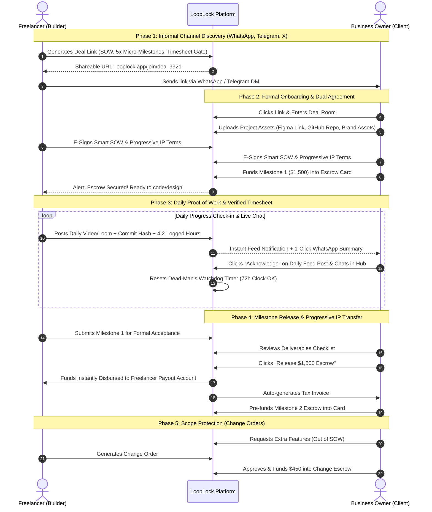
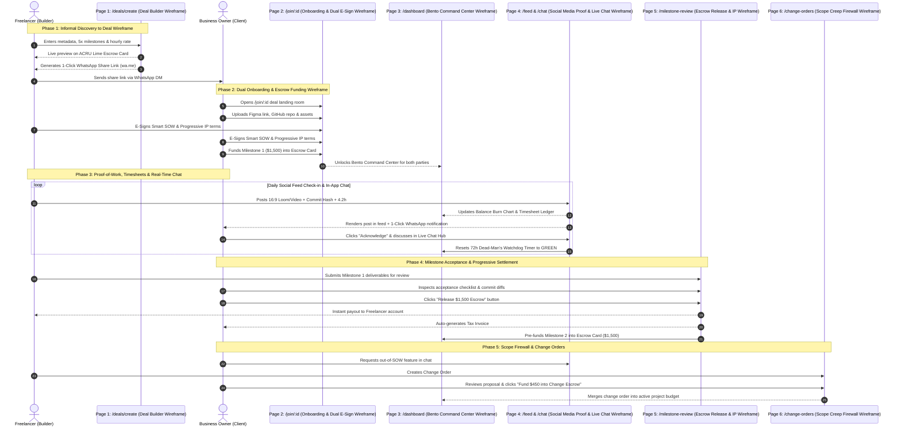
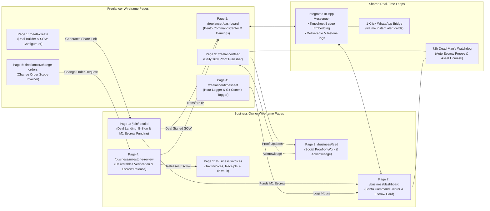
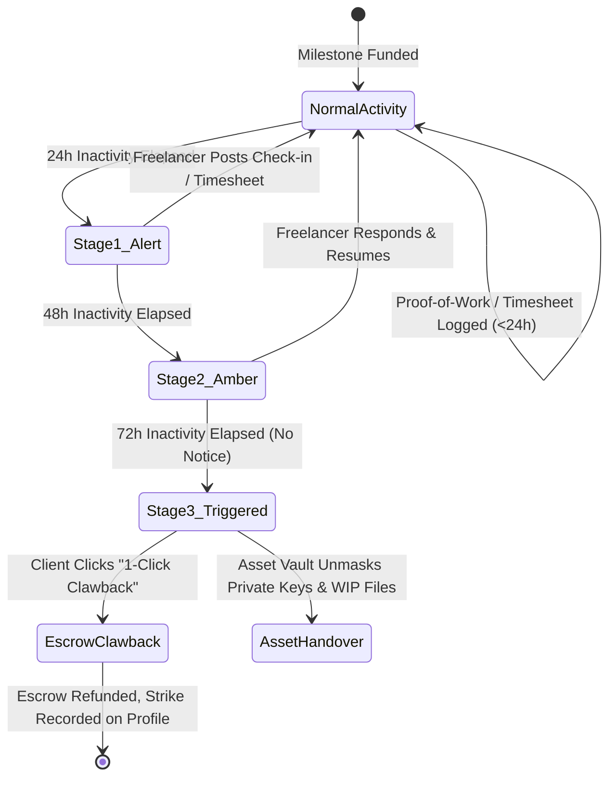

# LoopLock: Phase-by-Phase Wireframes & Page Architecture

**Project:** LoopLock — Social Accountability & Progressive Micro-Escrow  
**Target File:** `/Users/parth/Developer/BUILD/freelance-itch/wireframe.md`  
**Design Reference:** ACRU FinTech Dashboard (Observed Pixel Hierarchy)  
- Canvas: Cool off-white `#F1F3F6`  
- Cards: Pure white `#FFFFFF` with strict `24px` corner radius  
- Accents: Chartreuse / Lime Green `#88D635` + Dark Charcoal `#111827`  
- Spacing & Padding: Universal `24px` inner card padding (`p-6`), `16px` grid gaps — **zero arbitrary paddings**  

---

# SECTION 1: Global CSS Design Tokens & Strict UI Rules

All pages, modals, cards, and sub-views must adhere strictly to these global tokens to ensure 100% visual consistency without ad-hoc styles.

```css
/* ==========================================================================
   GLOBAL DESIGN TOKENS (ACRU PIXEL-PERFECT SPECIFICATION)
   ========================================================================== */
:root {
  /* Surfaces */
  --canvas-bg: #F1F3F6;                  /* App background */
  --surface-white: #FFFFFF;              /* All cards & containers */
  --surface-hover: #F8F9FA;              /* Hover state */
  --surface-subtle: #F4F5F7;             /* Input backgrounds & subtle pills */
  --border-card: rgba(0, 0, 0, 0.04);    /* Micro card border */
  --border-divider: #E5E7EB;             /* Universal section divider */

  /* Brand Accents */
  --accent-lime: #88D635;                /* Primary brand & funded escrow */
  --accent-lime-hover: #78C825;
  --accent-lime-tint: #E8F8D6;           /* Pill backgrounds */
  --accent-lime-gradient: linear-gradient(135deg, #88D635 0%, #68B420 100%);
  --accent-dark: #111827;                /* Primary CTAs & active nav items */
  --accent-dark-hover: #1F2937;
  --accent-orange: #F97316;              /* Warning & dead-man's alerts */
  --accent-yellow: #FACC15;              /* In-review status */
  --accent-forest: #15803D;              /* Completed & approved */
  --accent-red: #EF4444;                 /* Disputes & clawbacks */

  /* Typography */
  --text-primary: #111827;               /* Headings, values & titles */
  --text-secondary: #4B5563;             /* Body copy & descriptions */
  --text-muted: #9CA3AF;                 /* Timestamps & small labels */
  --text-on-dark: #FFFFFF;               /* Contrast on dark buttons */
  --text-on-lime: #0F2900;               /* Contrast on lime buttons */

  /* Structural Dimensions (Global Enforcement) */
  --radius-card: 24px;                   /* Applied to EVERY card container */
  --radius-nested: 16px;                 /* Applied to inner elements / charts */
  --radius-button: 14px;                 /* Applied to buttons */
  --radius-input: 12px;                  /* Applied to form inputs */
  --radius-pill: 9999px;                 /* Applied to badges & avatars */

  /* Padding & Spacing (Universal System) */
  --pad-card: 24px;                      /* Universal card inner padding (p-6) */
  --pad-card-sm: 16px;                   /* Compact card inner padding (p-4) */
  --gap-global: 16px;                    /* Global gap between columns & cards */
  --gap-section: 24px;                   /* Gap between major blocks */

  /* Shadows */
  --shadow-card: 0px 4px 20px rgba(0, 0, 0, 0.03), 0px 1px 3px rgba(0, 0, 0, 0.02);
  --shadow-button-dark: 0px 4px 12px rgba(17, 24, 39, 0.15);
  --shadow-lime: 0px 6px 16px rgba(136, 214, 53, 0.25);
}

/* Base Global Classes */
.card-base {
  background-color: var(--surface-white);
  border-radius: var(--radius-card);
  padding: var(--pad-card);
  border: 1px solid var(--border-card);
  box-shadow: var(--shadow-card);
}

.btn-primary-dark {
  background-color: var(--accent-dark);
  color: var(--text-on-dark);
  border-radius: var(--radius-button);
  padding: 12px 20px;
  font-weight: 600;
  font-size: 14px;
  border: none;
  cursor: pointer;
  box-shadow: var(--shadow-button-dark);
  display: inline-flex;
  align-items: center;
  gap: 8px;
  transition: all 0.15s ease;
}

.btn-primary-lime {
  background-color: var(--accent-lime);
  color: var(--text-on-lime);
  border-radius: var(--radius-button);
  padding: 12px 20px;
  font-weight: 700;
  font-size: 14px;
  border: none;
  cursor: pointer;
  box-shadow: var(--shadow-lime);
  display: inline-flex;
  align-items: center;
  gap: 8px;
  transition: all 0.15s ease;
}

.pill-badge {
  display: inline-flex;
  align-items: center;
  gap: 6px;
  padding: 4px 12px;
  border-radius: var(--radius-pill);
  font-size: 12px;
  font-weight: 600;
}
```

---

# SECTION 2: Master Sequence Maps

### 2.1 Business & Actor Flow


---

### 2.2 Web Pages & Wireframe Screens Sequence Diagram


---

### 2.3 Freelancer Dashboard Layout & Pages Wireframe (Mermaid)

```mermaid
flowchart TD
    subgraph FL_APP["FREELANCER APP WIREFRAME & LAYOUT ARCHITECTURE"]
        subgraph FL_SIDEBAR["Left Navigation Rail (240px)"]
            FL_LOGO["[Logo] ACRU / LoopLock"]
            FL_NAV1["[=] Active Projects"]
            FL_NAV2["[+] Create New Deal"]
            FL_NAV3["[🎬] Proof-of-Work Feed"]
            FL_NAV4["[⏱️] Timesheet & Hours"]
            FL_NAV5["[⚡] Change Orders"]
            FL_NAV6["[💳] Escrow Payouts"]
            FL_UPGRADE["[⚡ Trust Pro Widget]"]
        end

        subgraph FL_HEADER["Top Header Bar"]
            FL_SEARCH["[Q Search projects, commits, files...]"]
            FL_NOTIF["[🔔 Alerts]"]
            FL_PROFILE["[👤 Alex Rivera (Freelancer)]"]
            FL_NEW_BTN["[+ Create Deal Link (btn-dark)]"]
        end

        subgraph FL_BENTO["Center Content Canvas (Bento 3-Column)"]
            subgraph FL_ROW1["Row 1: Earnings & Project Progression"]
                FL_CARD_BURN["Balance & Earned Overview<br/>$12,450 Total Contract • Bar Chart (7d)<br/>[Yellow: In Review] [Lime: Earned]"]
                FL_CARD_METRICS["Metrics Stack<br/>• Secured in Escrow: $8,300<br/>• Disbursed to Bank: $6,700<br/>• Billable Hours: 34.7 hrs"]
            end
            subgraph FL_ROW2["Row 2: Daily Check-in & Media Publisher"]
                FL_POST_BOX["Proof-of-Work Publisher Card<br/>• Loom/Video embed uploader<br/>• ⏱️ Log daily hours (e.g. 4.2h)<br/>• 🔗 Git commit hash picker<br/>• [ Publish Update (btn-lime) ]"]
                FL_WATCHDOG_FL["Dead-Man's Watchdog Shield<br/>• Status: GREEN (Normal)<br/>• Next Check-in Due: in 66h<br/>• Inactivity Strikes: 0 (Clean)"]
            end
            subgraph FL_ROW3["Row 3: Active Milestones Stepper"]
                FL_M1["M1: DB Schema & Auth<br/>$1,500 [PAID & TRANSFERRED]"]
                FL_M2["M2: Core UI & API Sync<br/>$1,500 [UNDER REVIEW - 72h TIMER]"]
                FL_M3["M3: Production Deploy<br/>$1,500 [UPCOMING - LOCKED]"]
            end
        end

        subgraph FL_RIGHT["Right Action Rail (340px)"]
            FL_CARD_ESCROW["Virtual Escrow Debit Card<br/>Lime Gradient • $1,500.00 Active<br/>[Withdraw] [Request] [History]"]
            FL_CLIENT_LOOP["Client Quick Ping Strip<br/>Avatar: Sarah Chen (Client)<br/>[ 💬 1-Click WhatsApp wa.me ]"]
            FL_PAYOUT_STREAM["Recent Payouts Stream<br/>• +$1,500.00 M1 Milestone Paid<br/>• +$450.00 Change Order #1 Paid"]
        end
    end

    FL_SIDEBAR --> FL_BENTO
    FL_HEADER --> FL_BENTO
    FL_BENTO --> FL_RIGHT
```



---

### 2.4 Business Owner (Client) Dashboard Layout & Pages Wireframe (Mermaid)

```mermaid
flowchart TD
    subgraph BIZ_APP["BUSINESS OWNER (CLIENT) APP WIREFRAME & LAYOUT ARCHITECTURE"]
        subgraph BIZ_SIDEBAR["Left Navigation Rail (240px)"]
            BIZ_LOGO["[Logo] ACRU / LoopLock"]
            BIZ_NAV1["[=] Active Project Hub"]
            BIZ_NAV2["[💳] Milestone Escrow"]
            BIZ_NAV3["[🎬] Proof Verification Feed"]
            BIZ_NAV4["[⏱️] Timesheet Audit"]
            BIZ_NAV5["[📁] Asset Vault & Git"]
            BIZ_NAV6["[📄] Smart SOW & IP"]
            BIZ_NAV7["[🧾] Invoices & Tax Ledger"]
            BIZ_COLLAPSE["<< Collapse Sidebar"]
        end

        subgraph BIZ_HEADER["Top Header Bar"]
            BIZ_SEARCH["[Q Search files, commits, deliverables...]"]
            BIZ_NOTIF["[🔔 Alerts (1 Unread)]"]
            BIZ_PROFILE["[👤 Sarah Chen (Founder / TechVentures)]"]
            BIZ_FUND_BTN["[+ Fund Next Escrow Tranche]"]
        end

        subgraph BIZ_BENTO["Center Content Canvas (Bento 3-Column)"]
            subgraph BIZ_ROW1["Row 1: Budget Protection & Escrow Burn"]
                BIZ_CARD_CHART["Escrow Protection Overview<br/>$12,450 Budget • Segmented Chart (7d)<br/>[Yellow: Under Review] [Lime: Released]"]
                BIZ_CARD_HEALTH["Budget Health Stack<br/>• Escrow Protected: $8,300<br/>• Approved & Paid: $6,700<br/>• Remaining Contract: $4,500"]
            end
            subgraph BIZ_ROW2["Row 2: Acceptance & Review Action Deck"]
                BIZ_REVIEW_CARD["Active Milestone 2 Review Deck<br/>• Supabase Auth + RLS Rules verified<br/>• Commit: 8c3f20a • Hours: 18.2h logged<br/>[ ✅ Release $1,500 Escrow (btn-lime) ]<br/>[ 🔄 Request Revision (1 of 2 Left) ]"]
                BIZ_DEADMAN_CARD["Watchdog Inactivity Monitor<br/>• Freelancer Active: 4h ago<br/>• Dead-Man's Clawback: Armed<br/>• Emergency Asset Export: Ready"]
            end
            subgraph BIZ_ROW3["Row 3: Proof-of-Work Verification Stream"]
                BIZ_FEED_STREAM["Recent Social Feed Cards (16:9 Canvas)<br/>• Daily Loom walk-through video<br/>• PR diff: feat/oauth (+142 -12)<br/>• [ 👍 1-Click Acknowledge ]"]
            end
        end

        subgraph BIZ_RIGHT["Right Action Rail (340px)"]
            BIZ_ESCROW_WIDGET["Virtual Escrow Card<br/>Lime Gradient • $1,500 Held<br/>[Fund Tranche] [Release] [Dispute]"]
            BIZ_COLLAB_STRIP["Builder Quick Action Strip<br/>Avatar: Alex Rivera (Lead Dev)<br/>[ 💬 1-Click WhatsApp Ping ]"]
            BIZ_INVOICE_STREAM["Tax Invoices & IP Receipts<br/>• INV-2026-001 ($1,500) [PDF]<br/>• IP Transfer Certificate M1 [View]"]
        end
    end

    BIZ_SIDEBAR --> BIZ_BENTO
    BIZ_HEADER --> BIZ_BENTO
    BIZ_BENTO --> BIZ_RIGHT
```



---

### 2.5 Unified Multi-Page Site Wireframe Flow (Mermaid)



---

---

## PHASE 1: Informal Discovery & Deal Creation
**Route:** `/deals/create`  
**Primary Actor:** Freelancer (Builder)  
**Goal:** Convert informal conversations (WhatsApp, Telegram, X DMs) into a structured, micro-escrowed deal with a single shareable link.

### How Pages Connect & Data Flows:
- **Trigger**: Freelancer negotiates a gig informally. Instead of asking for a risky 50% bank transfer deposit, they visit `/deals/create`.
- **Data In**: Project Title, Client Name, Total Budget ($), Milestone Breakdown (15-25% each), Revision limits (default: 2), Timesheet Hourly Rate.
- **Data Out**: Deal Record created + Unique Shareable Invite URL (`looplock.app/join/deal-9921`).
- **Next Page**: Freelancer is directed to `/deals/deal-9921/invite-ready` with a 1-click `wa.me` share button.

### Page Wireframe (Route: `/deals/create`)

```
+-----------------------------------------------------------------------------------------------------------------------+
|  [Logo: ACRU / LoopLock]                                                          Step 1 of 2: Create Project Proposal |
+-----------------------------------------------------------------------------------------------------------------------+
|                                                                                                                       |
|   +--------------------------------------------------+  +---------------------------------------------------------+   |
|   | BLOCK 1.1: Deal Metadata & Client Info           |  | BLOCK 1.3: Real-Time Escrow Card Preview                |   |
|   |                                                  |  | (Pixel-matched lime-green debit card)                   |   |
|   | Project Title: [ Supabase SaaS Mobile MVP      ] |  | +-----------------------------------------------------+ |   |
|   | Client Name:   [ TechVentures Inc. (Sarah Chen)] |  | | LoopLock Smart Escrow Card      [Visa / Chip]       | |   |
|   | Client Email:  [ sarah@techventures.io         ] |  | | Total Contract: $4,500.00                           | |   |
|   | Currency:      [ USD ($)                      v] |  | | Tranches: 3 Milestones (33% each)                   | |   |
|   +--------------------------------------------------+  | | Dead-Man's Watchdog: 72h Active                     | |   |
|                                                         | +-----------------------------------------------------+ |   |
|   +--------------------------------------------------+  |                                                         |   |
|   | BLOCK 1.2: Micro-Milestone Allocator             |  | [ Escrow Safety Summary ]                               |   |
|   |                                                  |  | - Client never prepays 100% upfront                     |   |
|   | Milestone 1 (33%): [ DB Schema & Auth       ]    |  | - Freelancer never codes without funded escrow          |   |
|   | Amount: $1,500.00  | Est: 20 hrs  | Revs: 2      |  | - Progressive IP release on each milestone approval     |   |
|   | Checklist: [ + Add Deliverable Item ]            |  +---------------------------------------------------------+   |
|   |                                                  |                                                                |
|   | Milestone 2 (33%): [ Core UI & API Sync     ]    |  +---------------------------------------------------------+   |
|   | Amount: $1,500.00  | Est: 25 hrs  | Revs: 2      |  | BLOCK 1.4: One-Click Share Generator                    |   |
|   |                                                  |  |                                                         |   |
|   | Milestone 3 (33%): [ Deploy & Handover      ]    |  | Shareable Link:                                         |   |
|   | Amount: $1,500.00  | Est: 15 hrs  | Revs: 2      |  | [ https://looplock.app/join/deal-9921           [Copy] ]|   |
|   +--------------------------------------------------+  |                                                         |   |
|                                                         |  | [ Button: Share via WhatsApp (wa.me) ]                  |   |
|   [ Button: Generate Deal & Copy Share Link ]           |  | [ Button: Share via Telegram ]                          |   |
|                                                         +---------------------------------------------------------+   |
+-----------------------------------------------------------------------------------------------------------------------+
```

---

## PHASE 2: Formal Onboarding, Asset Custody & Dual Agreement
**Route:** `/join/[dealId]`  
**Primary Actors:** Business Owner (Client) + Freelancer (Builder)  
**Goal:** Dual digital execution of the Smart SOW, custody of project assets, and pre-funding Milestone 1 into escrow.

### How Pages Connect & Data Flows:
- **Trigger**: Client opens the `looplock.app/join/deal-9921` link from WhatsApp/Telegram.
- **Data In**: Client e-signature, Freelancer e-signature, Initial Git/Figma links, Milestone 1 payment authorization ($1,500).
- **Data Out**: Dual-signed Smart SOW contract record, Milestone 1 state set to `FUNDED_IN_ESCROW`, Proforma Invoice generated.
- **Next Page**: Unlocks the Active Project Hub `/project/deal-9921/dashboard`.

### Page Wireframe (Route: `/join/[dealId]`)

```
+-----------------------------------------------------------------------------------------------------------------------+
|  [Logo: ACRU / LoopLock]                                                 Deal Invitation: "Supabase SaaS Mobile MVP"  |
+-----------------------------------------------------------------------------------------------------------------------+
|                                                                                                                       |
|   +--------------------------------------------------+  +---------------------------------------------------------+   |
|   | BLOCK 2.1: SOW Review & Acceptance Checklist     |  | BLOCK 2.3: Asset Custody Locker                         |   |
|   |                                                  |  |                                                         |   |
|   | Milestone 1: DB Schema & Auth ($1,500.00)        |  | Business Owner: Attach project references & assets:     |   |
|   | - Supabase setup with Google OAuth & Magic Link  |  | - Figma URL:      [ figma.com/file/9924a/App-Design   ] |   |
|   | - Prisma schema migrations for 6 core tables     |  | - GitHub Repo:    [ github.com/client/supabase-mvp    ] |   |
|   | - Unit test suite with >85% coverage             |  | - Google Drive:   [ drive.google.com/folder/assets    ] |   |
|   |                                                  |  +---------------------------------------------------------+   |
|   | Total Project Escrow: $4,500.00                  |                                                                |
|   | Included Revisions: 2 per milestone              |  +---------------------------------------------------------+   |
|   +--------------------------------------------------+  | BLOCK 2.4: Milestone 1 Escrow Funding Checkout          |   |
|                                                         |                                                         |   |
|   +--------------------------------------------------+  | Amount to Fund Now: $1,500.00 (Milestone 1 only)        |   |
|   | BLOCK 2.2: Dual Digital E-Signature Room         |  | Held safely in neutral platform escrow.                 |   |
|   |                                                  |  | Payment Method: [ Visa ending in 4242                 v]|   |
|   | [X] I agree to the Progressive IP Terms &        |  |                                                         |   |
|   |     72h Dead-Man's Switch Inactivity Policy      |  | [ Button: Sign Contract & Fund $1,500 Escrow (btn-lime)]|   |
|   |                                                  |  +---------------------------------------------------------+   |
|   | Freelancer: Alex Rivera  [ SIGNED: 14:22 UTC ]   |                                                                |
|   | Client:     Sarah Chen   [ Enter Full Legal Name]|                                                                |
+-----------------------------------------------------------------------------------------------------------------------+
```

---

## PHASE 3: Active Project Command Hub & Real-time Collaboration
**Route:** `/project/[dealId]/dashboard` (Master Bento Command Center)  
**Primary Actors:** Client & Freelancer in a shared loop  
**Goal:** Total transparency—daily visual proof-of-work, real-time messaging, timesheet hour audits, and 72h watchdog monitoring.

### How Pages Connect & Data Flows:
- **Trigger**: Both parties enter the command center once Milestone 1 is funded.
- **Data In**: Daily video/Loom posts, logged hours, Git commit hashes, client acknowledgments, chat messages.
- **Data Out**: Timesheet entries, updated project burn charts, watchdog timer reset.
- **Child Tabs Available**:
  1. `[Dashboard]` (Bento command overview)
  2. `[Proof Feed]` (Full-screen social showcase feed)
  3. `[Timesheets]` (Detailed hour log & CSV/PDF exporter)
  4. `[Asset Vault]` (Code repository & Figma version locker)
  5. `[Chat & WA]` (Integrated project messenger)

### Master Command Center Wireframe (Route: `/project/[dealId]/dashboard`)
*Exact 3-column bento architecture matching the reference ACRU dashboard.*

```
+-----------------------------------------------------------------------------------------------------------------------------------------------+
| TOP HEADER: [Q Quick search files, commits, milestones...]                [🔔 Notifications] [⚙️ Settings] [👤 Michael J. (Client)] [+ Add Widget] |
+-----------------------------------------------------------------------------------------------------------------------------------------------+
| LEFT SIDEBAR (240px) | CENTER MAIN CONTENT COLUMN                                                   | RIGHT SIDEBAR (340px)                   |
|                      |                                                                              |                                         |
| [ACRU / LoopLock]    | BLOCK 3.3: Balance Overview & Escrow Burn Chart (Card)                       | BLOCK 3.5: Virtual Escrow Card Widget   |
|                      | Big Value: $12,450.00                                  [7d v] [Bar | Line]   | +-------------------------------------+ |
| [=] Dashboard (Active| Subtitle: Balance overview & milestone progression                           | | LoopLock Escrow Card  [Visa / Chip] | |
| [👤] Collaborators   | Legend: [Yellow] In Review  [Lime] Released/Earned  [Orange] Remaining Escrow| | $1,500.00 FUNDED (M2)               | |
| [💳] Escrow Milestones|                                                                              | | **** **** **** 7890         03/30   | |
| [🎬] Proof Feed      | [ Segmented Bar Chart: Sun | Mon | Tue | Wed (Hover: $700) | Thu | Fri | Sat ]| +-------------------------------------+ |
| [⏱️] Timesheets       |                                                                              | [Top up] [Release] [Request] [Time] [.] |
| [📁] Asset Vault     +------------------------------------------------------------------------------+                                         |
| [📄] Smart SOW       | BLOCK 3.4: Quick Metrics Triplet (Row)                                       | BLOCK 3.6: Active Loop & Quick Ping     |
| [🧾] Invoices        | - Total Escrow Secured: $15,000.00 (↗ +5.1%)                                 | Avatars: Alex R. (Dev), Sarah C. (Owner)|
| [🛡️] Dead-Man Watch  | - Paid Deliverables:    $6,700.00  (Disbursed)                              | 1-Click Action: [ 💬 WhatsApp wa.me ]   |
|                      | - Held in Neutral Escrow: $8,300.00 (Safe)                                   |                                         |
|                      +------------------------------------------------------------------------------+ BLOCK 3.7: Escrow Transaction Stream   |
| [⚡ Upgrade to Pro!]  | BLOCK 3.8: Inactivity Watchdog & Milestone Goal Tracker                      | - Milestone 1 Release: +$1,500.00 (Paid)|
| Legal IP insurance   | - Milestone 1: DB Schema & Auth   [ Lime Bar 100% ] $1,500 / $1,500 (Released) | - Change Order #1:     +$450.00 (Funded)|
| [ Upgrade now ]      | - Milestone 2: Core Auth & RLS    [ Lime Bar 75%  ] $1,125 / $1,500 (Review)   | - Milestone 2 Escrow:  +$1,500 (In Hold)|
|                      | - Milestone 3: Deploy & Handover  [ Gray Bar 0%   ] $0 / $1,500 (Upcoming)    | [ View all transactions > ]             |
| << Collapse sidebar  | Watchdog Timer: [ ⏱️ 66h until Dead-Man's Switch Escalate (NORMAL - GREEN) ] |                                         |
+-----------------------------------------------------------------------------------------------------------------------------------------------+
```

---

### SUB-VIEW 3.1: Social "Proof-of-Work" Media Feed View
**Route:** `/project/[dealId]/feed`  
**Purpose:** Replaces silent off-platform text check-ins with visual verification.

```
+-----------------------------------------------------------------------------------------------------------------------+
| BLOCK 3.1.1: Post Creation Bar (Freelancer View)                                                                      |
| [ Input: Share today's Proof of Work walkthrough (Loom URL, screenshot diff, or Git commit hash)...                 ] |
| [ 📹 Add Loom/Video ]  [ 🖼️ Add Screenshot ]  [ ⏱️ Log Hours: 4.5h ]  [ 🔗 Git: feat/auth-v2 ]  [ Button: Publish ]   |
+-----------------------------------------------------------------------------------------------------------------------+
|                                                                                                                       |
| BLOCK 3.1.2: Media Showcase Card (16:9 Showcase Canvas)                                                               |
| +-------------------------------------------------------------------------------------------------------------------+ |
| | [Avatar] Alex Rivera (Freelancer) • Posted 4 hours ago • Milestone 2: "Authentication & Schema"                   | |
| | Title: "Implemented NextAuth Google Provider + Row-Level Security Rules on User Table"                            | |
| +-------------------------------------------------------------------------------------------------------------------+ |
| |                                                                                                                   | |
| |   +-----------------------------------------------------------------------------------------------------------+   | |
| |   |                                                                                                           |   | |
| |   |                                     [ 16:9 MEDIA SHOWCASE CANVAS ]                                        |   | |
| |   |                                Interactive Loom / Video Walkthrough Player                                |   | |
| |   |                                                                                                           |   | |
| |   +-----------------------------------------------------------------------------------------------------------+   | |
| |                                                                                                                   | |
| |   METADATA TAGS:                                                                                                  | |
| |   [ ⏱️ 4.2 Hours Logged ]  [ 🔗 Git: 8c3f20a ]  [ 📁 src/lib/auth.ts (+142 -12) ]  [ 🏷️ Version 1.2 ]              | |
| |                                                                                                                   | |
| |   DELIVERABLE CHECKLIST UPDATES:                                                                                  | |
| |   [X] Setup OAuth callbacks   [X] Encrypt JWT session cookies   [ ] Unit tests for tenant isolation (In progress)  | |
| |                                                                                                                   | |
| |   SOCIAL & CLIENT ACTIONS:                                                                                        | |
| |   [ Button: 👍 Acknowledge (Client) ]   [ 💬 Threaded Comments (2) ]   [ ⚡ Open Loom ]   [ 📜 View Commit Diff ]     | |
| +-------------------------------------------------------------------------------------------------------------------+ |
```

---

### SUB-VIEW 3.2: Integrated Project Messenger & WhatsApp Action Bridge
**Route:** `/project/[dealId]/chat`  
**Purpose:** Centralizes discussions so sidebar negotiations can never create un-documented scope creep.

```
+-----------------------------------------------------------------------------------------------------------------------+
| BLOCK 3.2.1: In-App Chat Header: Project "Supabase SaaS Mobile MVP"                    [ 🟢 Both Parties Online ]      |
+-----------------------------------------------------------------------------------------------------------------------+
|                                                                                                                       |
|  [Sarah Chen - Client 10:14 AM]                                                                                       |
|  "Hey Alex, the Loom walkthrough for OAuth looks incredible! One quick question: does it support Magic Link too?"    |
|                                                                                                                       |
|  [Alex Rivera - Freelancer 10:18 AM]                                                                                  |
|  "Yes! Just added magic link via Resend. Logged 2 hours under Milestone 2 checklist item 1. Commit: 7a82c."         |
|  [ Embedded Badge: Timesheet Entry #TS-44 (2.0h) • Commit: 7a82c • Status: Verified ]                                 |
|                                                                                                                       |
|  +-----------------------------------------------------------------------------------------------------------------+  |
|  | SYSTEM ACTION CARD: "Milestone 2 Acceptance Ready for Review"                                                   |  |
|  | All checklist deliverables completed. 72h Review Window active.                                                 |  |
|  | [ Button: Open Milestone Acceptance Room ]   [ Button: 1-Click WhatsApp Notification (wa.me) ]                  |  |
|  +-----------------------------------------------------------------------------------------------------------------+  |
|                                                                                                                       |
|  [ Input: Type a message, tag a milestone (#M2), or attach an asset link...                           [ Send ] ]      |
+-----------------------------------------------------------------------------------------------------------------------+
```

---

## PHASE 4: Milestone Review, Escrow Release & Progressive IP Transfer
**Route:** `/project/[dealId]/milestone-review`  
**Primary Actor:** Business Owner (Client)  
**Goal:** Verify checklist items, release escrow safely, transfer milestone IP, generate formal tax invoices, and fund the next tranche.

### How Pages Connect & Data Flows:
- **Trigger**: Freelancer completes the milestone checklist and submits for review.
- **Data In**: Freelancer's final commit tag, hours summary (`18.2h / 20.0h`), video walkthrough link.
- **Data Out**: Escrow release transaction executed, Tax Invoice generated (`#INV-2026-001`), Milestone 1 IP Certificate signed & transferred, Milestone 2 pre-funded.
- **Next Page**: Project advances to next milestone; invoice added to `/project/[dealId]/invoices`.

### Page Wireframe (Route: `/project/[dealId]/milestone-review`)

```
+-----------------------------------------------------------------------------------------------------------------------+
|  [Logo: ACRU / LoopLock]                                     Milestone Acceptance: "Milestone 1: DB Schema & Auth"   |
+-----------------------------------------------------------------------------------------------------------------------+
|                                                                                                                       |
|   +--------------------------------------------------+  +---------------------------------------------------------+   |
|   | BLOCK 4.1: Deliverables Verification Checklist   |  | BLOCK 4.3: Financial Release Summary                    |   |
|   |                                                  |  |                                                         |   |
|   | [X] Supabase Auth with Google & Magic Link       |  | Amount Held in Escrow: $1,500.00                        |   |
|   |     Verified in commit: 8c3f20a                  |  | Platform Fee (0% to client): $0.00                      |   |
|   | [X] Prisma schema with 6 tables & migrations     |  | Total Disbursed to Freelancer: $1,500.00                |   |
|   |     Verified in commit: a1f902b                  |  |                                                         |   |
|   | [X] Unit test suite (>85% coverage passed)       |  | IP Transfer Clause:                                     |   |
|   |     Verified in CI run #482                      |  | "Upon clicking Release, 100% of IP, source code, and   |   |
|   |                                                  |  | designs for Milestone 1 unconditionally transfer to     |   |
|   | Total Hours Logged: 18.2 hrs / 20.0 hrs budget   |  | TechVentures Inc."                                      |   |
|   +--------------------------------------------------+  +---------------------------------------------------------+   |
|                                                                                                                       |
|   +--------------------------------------------------+  +---------------------------------------------------------+   |
|   | BLOCK 4.2: Client Decision Deck                  |  | BLOCK 4.4: Next Tranche Pre-Funding                     |   |
|   |                                                  |  |                                                         |   |
|   | [ Button: ✅ Release $1,500 Escrow (btn-lime) ]  |  | Pre-fund Milestone 2 ($1,500.00):                       |   |
|   | -> Triggers instant payout to freelancer         |  | [X] Auto-fund Milestone 2 to maintain momentum          |   |
|   | -> Generates Tax Invoice #INV-2026-001           |  |                                                         |   |
|   |                                                  |  | Generated Tax Document:                                 |   |
|   | [ Button: 🔄 Request Revision (1 of 2 Left) ]    |  | Tax Invoice #INV-2026-001 (PDF ready upon release)      |   |
|   +--------------------------------------------------+  +---------------------------------------------------------+   |
+-----------------------------------------------------------------------------------------------------------------------+
```

---

## PHASE 5: Scope Protection & Change-Order Firewall
**Route:** `/project/[dealId]/change-orders`  
**Primary Actors:** Client & Freelancer  
**Goal:** Prevent mid-project ghosting caused by unpaid scope creep. Every extra feature is formally priced, estimated in hours, and pre-funded into escrow before work begins.

### How Pages Connect & Data Flows:
- **Trigger**: Client requests a feature not in the original SOW checklist, or exceeds the 2 included revision rounds.
- **Data In**: Change title, justification, added price ($), added hours estimate.
- **Data Out**: Change Order Record (`#CO-001`), change order escrow status `PENDING_DEPOSIT`.
- **Next Page**: Client funds change order escrow; work is scheduled without disrupting active milestones.

### Page Wireframe (Route: `/project/[dealId]/change-orders`)

```
+-----------------------------------------------------------------------------------------------------------------------+
|  [Logo: ACRU / LoopLock]                                                 Scope Firewall & Change Order Management     |
+-----------------------------------------------------------------------------------------------------------------------+
|                                                                                                                       |
|   +--------------------------------------------------+  +---------------------------------------------------------+   |
|   | BLOCK 5.1: Revision Quota Watchdog               |  | BLOCK 5.3: Create New Change Order Proposal             |   |
|   |                                                  |  | (Freelancer or Client may initiate)                     |   |
|   | Milestone 1: 0 Revisions Used (Approved)         |  |                                                         |   |
|   | Milestone 2: 1 of 2 Revisions Used [ 1 Left ]    |  | Feature Title:  [ Stripe Subscriptions & Webhook Handler] |
|   | Milestone 3: 0 of 2 Revisions Used [ 2 Left ]    |  | Justification:  [ Added customer portal & subscription ]|
|   |                                                  |  | Additional Cost: [ +$450.00                           ] |   |
|   | Note: Any out-of-scope work requires a funded    |  | Additional Time: [ +6.0 Estimated Hours               ] |   |
|   | Change Order before code is written.             |  |                                                         |   |
|   +--------------------------------------------------+  | [ Button: Submit Change Order Proposal (btn-dark) ]     |   |
|                                                         +---------------------------------------------------------+   |
|   +---------------------------------------------------------------------------------------------------------------+   |
|   | BLOCK 5.2: Active Change Orders Table                                                                         |   |
|   |                                                                                                               |   |
|   | ID      | TITLE                         | ORIGIN | COST   | HOURS | STATUS            | ACTION                |   |
|   |---------+-------------------------------+--------+--------+-------+-------------------+-----------------------|   |
|   | #CO-001 | Stripe Subscription Webhooks  | Client | +$450  | +6.0h | Pending Deposit   | [ Fund Escrow (Lime)] |   |
|   | #CO-002 | Dark Mode Theme Toggle        | Client | +$200  | +3.0h | Approved & Funded | [ In Progress ]       |   |
|   +---------------------------------------------------------------------------------------------------------------+   |
+-----------------------------------------------------------------------------------------------------------------------+
```

---

# SECTION 4: Inactivity & Dead-Man's Switch Escalation Protocol



- **Stage 1 (24h Inactive)**: Gentle push notification + WhatsApp ping sent to freelancer.
- **Stage 2 (48h Inactive)**: Amber alert displayed in dashboard; timesheet entries temporarily frozen.
- **Stage 3 (72h Inactive)**: Dead-Man's Switch triggers:
  1. Milestone escrow locks automatically.
  2. Client dashboard unlocks a 1-click `Clawback Escrow & Abort` action.
  3. Asset Vault immediately unmasks private repository branches, Figma edit links, and WIP files to the client.
  4. Freelancer public profile receives an immutable `Ghosting Inactivity Strike`.

---

# SECTION 5: Global Layout & Page Component Standards

To prevent layout drift or inconsistent styles, all pages are built with these exact components:

1. **Card Container**:
   - `background: #FFFFFF; border-radius: 24px; padding: 24px; border: 1px solid rgba(0,0,0,0.04); box-shadow: 0px 4px 20px rgba(0,0,0,0.03);`
2. **Primary Action Button (Dark)**:
   - `background: #111827; color: #FFFFFF; border-radius: 14px; padding: 12px 20px; font-weight: 600;`
3. **Primary Action Button (Lime Accent)**:
   - `background: #88D635; color: #0F2900; border-radius: 14px; padding: 12px 20px; font-weight: 700; box-shadow: 0px 6px 16px rgba(136, 214, 53, 0.25);`
4. **Virtual Escrow Card**:
   - `background: linear-gradient(135deg, #88D635 0%, #68B420 100%); border-radius: 20px; padding: 22px; color: #113600; height: 180px;`
5. **Universal Layout Grid**:
   - Left Navigation Rail (`240px`), Main Content Column (`1fr`), Right Action Sidebar (`340px`), Global Gap (`16px`).

---

# SECTION 6: Built Component Library Inventory (Pixel-Matched to ref.webp)

The foundational component library has been built directly in `src/components/ui/` with exact pixel-matching to `ref.webp` and zero unnecessary bloat:

| Component Name | File Path | Matches in `ref.webp` | Description & Variants |
| :--- | :--- | :--- | :--- |
| **`Card`** | `src/components/ui/card.tsx` | All surface cards | Strict `24px` radius, `p-6` padding, `border-black/[0.04]`, shadow `0px 4px 20px rgba(0,0,0,0.03)`. Includes `CardHeader`, `CardTitle`, `CardDescription`, `CardContent`. |
| **`Button`** | `src/components/ui/button.tsx` | Dark and pill buttons | Variants: `dark` (Slate-900 `#111827`), `lime` (`#88D635`), `outline`, `ghost`, `pill`, `icon` (40x40px). |
| **`Badge`** | `src/components/ui/badge.tsx` | Status pills & counts | Variants: `lime`, `dark`, `yellow`, `orange`, `forest`, `red`, `gray`, `outline`. |
| **`SearchInput`** | `src/components/ui/input.tsx` | Header search pill | Rounded pill input with left magnifying glass icon and clean focus ring. |
| **`VirtualEscrowCard`** | `src/components/ui/virtual-escrow-card.tsx` | Green debit card + 5 actions | Lime gradient (`#88D635` to `#599B15`), EMV golden chip, masked card number, Visa/Protection shield, and 5 action buttons: **Top up / Fund**, **Release**, **Request**, **History**, **More**. |
| **`BalanceBarChart`** | `src/components/ui/balance-bar-chart.tsx` | Main balance chart (`$12,450`) | 7-day segmented vertical bars (Sun–Sat) with Yellow (In Review), Lime (Released), and Orange (Remaining), 7d filter dropdown, and interactive hover tooltip breakdown card. |
| **`MetricStack`** | `src/components/ui/metric-stack.tsx` | 3-card metrics stack | Total Escrow Secured (`$15,000`), Released Deliverables (`$6,700`), Active In Escrow (`$8,300`) with trending pills (`+5.1%`, `+15.5%`, `+20.7%`). |
| **`RadialGauge`** | `src/components/ui/radial-gauge.tsx` | Financial health gauge (`$15,780`) | Semi-circular radial arc gauge in lime gradient with "85% Milestones Delivered" and 30d filter. |
| **`GoalTracker`** | `src/components/ui/goal-tracker.tsx` | Goal tracker progress list | Progress bar rows with custom icons, current/target amounts (`$1,500 / $1,500`), and milestone status. |
| **`CostAnalysis`** | `src/components/ui/cost-analysis.tsx` | Cost analysis segmented bar | Multi-colored horizontal segmented progress bar (`$8,450`) with category percentages (Architecture, Auth, UI, API, Deploy, Contingency). |
| **`SpendingLimitCard`**| `src/components/ui/spending-limit-card.tsx` | Monthly spending limit | Progress bar with solid lime-green fill, `$8,600 / $10,000` labels, and pencil edit icon. |
| **`QuickTipCard`** | `src/components/ui/quick-tip-card.tsx` | Quick tips with mosaic art | Dead-man's watchdog advisory card with 4-square isometric blocks illustration in pastel greens and "Read policy >". |
| **`QuickCollaborators`**| `src/components/ui/quick-collaborators.tsx` | Quick payment avatar strip | Horizontal avatar list with online status indicator dot and 1-click WhatsApp / chat link. |
| **`TransactionList`** | `src/components/ui/transaction-list.tsx` | Transaction history list | Escrow ledger stream with +/- amounts, release/deposit icons, dates, and status pills (Completed, In Escrow, Declined). |
| **`SidebarRail`** | `src/components/ui/sidebar-rail.tsx` | Left 240px navigation rail | ACRU / LoopLock brand logo, active navigation item pill, numeric counter badge ("3 Active"), Pro upgrade callout with bolt icon, and collapse toggle. |
| **`HeaderBar`** | `src/components/ui/header-bar.tsx` | Top global header bar | Search input, notification bell with red ping dot, settings gear icon, user profile pill (Avatar + Name + Email), and "+ Add widget" button. |

